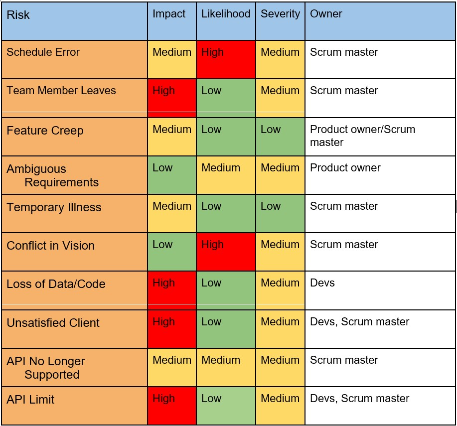

# Risk Register
The following risk register outlines potential risks that could affect the delivery/success of the project.
# Contents
1. [Scheduling Errors](#sched)
2. [Team Member Leaves](#leaves)
3. [Feature Creep](#creep)
4. [Ambiguous Requirements](#ambig)
5. [Temporary Illness](#illness)
6. [Conflict in Vision](#vision)
7. [Loss of Data/Code](#lossdata)
8. [Client Unsatisfied Post-Sprint](#unsatisfied)
9. [API No Longer Supported](#api)
10. [Limited API calls](#apiLimit)
11. [Incorrect Workload Allocation](#workload)  
11. [Introduce major bug to live build](#bug)

# Risk Matrix

## **1. Scheduling Errors**
>### **Description**
>In the event that the timeline of the project is underestimated, and sprint deliverables are not delivered on time or up to scratch.  
>### **Impact and Likelihood**
>The likelihood of this happening is quite high, as it is tough to get a guage of exactly how long certain tasks will take, given that many factors are at play.  
>If this happens during the project, the impact would be moderate. Certain tasks would need to be pushed back to the next sprint and certain features may have to be delayed. The product backlog would be need reconfiguration.
>### **Monitoring Strategy**
>Each team meeting, need to address concerns relating to the schedule. Scrum master should touch base with developers frequently to make sure they are on track.
>### **Mitigation Plan**
>Catching any scheduling flaws early will help the process. Once they are identified, extra personel can be shifted from features that are ahead of schedule to help implement the tougher feature.

## **2. Team Member Leaves / MIA**
>### **Description**
>If a team member leaves midway through a sprint, and is not reachable by any communication.
>### **Impact and Likelihood**
>The likelihood of this occurring is quite low, as it is unusual for a team member to go complete radio silence.  
>The impact of a member leaving would be very high, as it would leave their portion of the sprint incomplete, potentially missing crucial code/data needed for the delivery.
>### **Monitoring Strategy**
>Frequent meetings to check progress will also help identify team members who have gone MIA. Furthermore, checking git frequently will identify members who are not actively doing work (IE members not pushing anything)
>### **Mitigation Plan**
>In the event that this does happen, an urgent meeting will be scheduled to discuss how the missing persons remaining tasks will be delegated between remaining members. This may also involve changing what will be delivered in the current sprint (IE delaying a feature)

## **3. May Have Feature Creep**
>### **Description**
>When unnecessary and excessive new features keep getting added to the project. May lose the practicality and could bloat the software, conflicting with the project vision, and detracting from user experience.
>### **Impact and Likelihood**
>The likelihood of this occurring in this project is quite low, especially during this semester alone. The likelihood may increase if the project is to continue into the future.  
>The impact would be moderate. While feature creep will not ruin the project, it may decrease its effectiveness due to bloat, especially if feature creep continues for a long period.
>### **Monitoring Strategy**
>Consult with the product owner about what features are fundamental for the project and contribute meaningfully. Product backlog should be frequently maintained and adjusted with this mindset.
>### **Mitigation Plan**
>Have clear requirements at project inception. At each meeting with the product owner, revise all features that are in the queue for their usefulness to the project. Lower the priority/remove features that conflict with the project vision at each revision of the product backlog.

## **4. Ambiguous Requirements from Client**
>### **Description**
>May occur when the product owner does not have a clear understanding of what features they want in the project.
>### **Impact and Likelihood**
>Moderate likelihood, as there are certainly features the product owner may want, yet they cannot express it well or have not thought extensively about what exactly they want from it.  
>Low impact, as the requirements can be clarified
>### **Monitoring Strategy**
>After requirements are added, have a team meeting to confirm that everyone is happy with the specificity.
>### **Mitigation Plan**
>If requirements from the product owner are vague, schedule another urgent meeting with them to clear up issues. If the product owner cannot elaborate further, a choice can be made to either axe the feature, or for the scrum master and team to fill in the blanks and continue implementing the feature.  

## **5. Temporary Illness/Incapacitation**
>### **Description**
>Occurs when a team member is temporarily out of action and cannot contribute to the project for a certain period (EG has COVID).
>### **Impact and Likelihood**
>Low likelihood of occurring, especially while in lockdown.
>Impact would be moderate, as it is effectively losing a team member for a certain period, and could delay deliverables.
>### **Monitoring Strategy**
>N/A
>### **Mitigation Plan**
>Wear face masks, use hand sanitiser. If someone does get ill, then delegate their tasks until the team member can return. May have to delay deliverables if needed.

## **6. Conflict in Future Direction of Project**
>### **Description**
>If at some stage later in the project, the vision between team members starts to conflict. Some people may want to take the project in a different direction to others, and conflict can arise.
>### **Impact and Likelihood**
>High likelihood of occurring, as people will always have slightly different views on where to steer the project and what features to implement.
>Low impact, because acceptance and compromising on different views is achievable.
>### **Monitoring Strategy**
>N/A
>### **Mitigation Plan**
>If there is a conflict, both ideas are listened to and discussed thoroughly. Aim to reach a compromise with both parties, and if a compromise cannot be reached, the scrum master and product owner get the final say on the course of action.

## **7. Loss of Data / Code**
>### **Description**
>Hardware failure or other issues that may cause a loss of data and/or code. For example, if someone's local machine breaks down.
>### **Impact and Likelihood**
>Low likelihood of occurring, as hardware breaking issues are rare.
>High impact, because of the potential for large amounts of progress and development time could be lost.
>### **Monitoring Strategy**
>N/A
>### **Mitigation Plan**
>Keep care of devices. Frequent pushes to git repo to backup progress.

## **8. Client Unsatisfied After Sprint**
>### **Description**
>If the client sees the end result of a sprint and is unsatisfied with what is produced. 
>### **Impact and Likelihood**
>Low likelihood of occurring, due to processes in place (meetings with product owner)
>High impact, because if the client is unsatisfied, then the sprint is a huge waste of developer time and may need to be done again or revised.
>### **Monitoring Strategy**
>Have an open line of communication with the product owner and have meetings showing progress.
>Also frequent team meetings will allow the scrum master to keep a close eye on what is happening.
>### **Mitigation Plan**
>If the client does end up unsatisfied, discuss with them what changes they want to see and add these items to the product backlog (with high priority). This is the only way to progress once the sprint itself is finished, and it may be costly in terms of time.

## **9. API No Longer Supported**
>### **Description**
>The apis used to retrieve sports data may be discontinued. Another possibility is that they are updated and current code in the project no longer works.
>### **Impact and Likelihood**
>Moderate likelihood of occurring, especially in the long-term. Support for the API will most likely not last forever.
>Moderate Impact, as refactoring may need to be done.
>### **Monitoring Strategy**
>Continue to check the websites and documentation of the APIs, and be aware of upcoming updates/changes to the API.
>### **Mitigation Plan**
>Collect a source of alternative APIs just in case the current API no longer is supported. In the long term, the potential to create our own API/data-source will completely mitigate this risk all together.  

## **10. Limited Daily API calls interferes with development** - 15/9/21
>### **Description**
>Only a certain number of calls can be made to the api each day under the free subscription. Could interfere with development.
>### **Impact and Likelihood**
>High likelihood of occurring, as during development there will be phases when many api calls will need to be made to implement certain features and test them. The impact is low, as a new email can be used to sign up to the API quite easily, or can use another team members key for that day (if they are not using it).
>### **Monitoring Strategy**
>Be aware of who needs a lot of api calls when assigning PBIs in the sprint planning phase. 
>### **Mitigation Plan**
>Contact the group on agreed forms of communication, and ask for their keys, else create a new account for a new key.

## **11. Incorrect Workload Allocations** - 15/9/21
>### **Description**
>Estimation of user stories can be inaccurate, so in sprints, some members may be allocated an unfair share of the workload.
>### **Impact and Likelihood**
>High likelihood of this occurring, because user story estimation is not always reliable. Impact is moderate, as there are work arounds to solve this issue if caught early.
>### **Monitoring Strategy**
>At team meetings and team check-ins, Scrum Master should assess how everyone is tracking with their tasks and if they are meeting the velocity required to complete their tasks. Furthermore, if a member is struggling, they should reach out to the groupchat. Overall, frequent communication is key.
>### **Mitigation Plan**
>Team consultation should be done, preferably in a meeting, to organise if another member who is ahead of velocity can help out. Furthermore, live share (pair programming) can aid where the tasks are difficult  
## **12. Recoverability** - 14/10/21 
>### **Description**
> If bugs are unknowingly introduced during a patch/iteration.  
>### **Impact and Likelihood**  
>Low likelihood of happening, as sprint reviews and acceptance tests should in theory prevent major bugs from being introduced. High impact if it does occur, as faults in the app could compromise functionality drastically.  
>### **Monitoring Strategy**  
>Conduct thorough QA and end-to-end testing when deploying a new patch.  
>### **Mitigation Plan**
>If a major bug ends up being introduced in a live version, depending on the severity of the bug, a previous version of the application can be reinstated directly from the gitlab repository.  